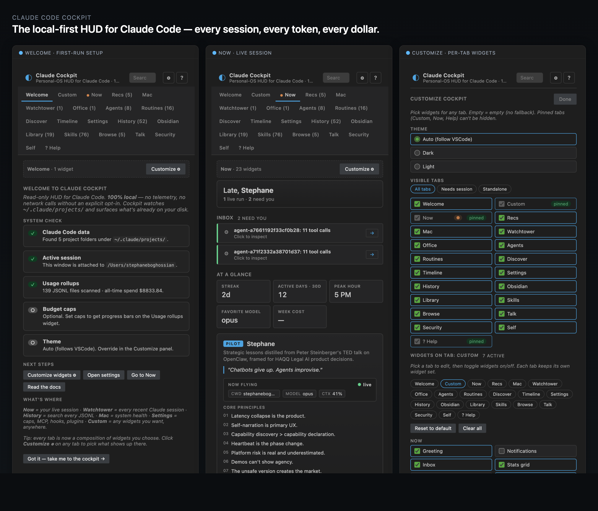

# Claude Code Cockpit

> The local-first HUD for Claude Code. Every session, every token, every dollar — in your VSCode sidebar. Read-only by default. 100% local until you opt in.

[](https://marketplace.visualstudio.com/items?itemName=dashable.claude-code-cockpit) [](https://github.com/sboghossian/claude-code-cockpit/releases) [](LICENSE)



Surfaces the state Claude Code already writes to disk. Plus your Mac. Plus your Obsidian. Plus claude.ai. **Customizable**: a header strip with logo + actions sits above a tab bar you control — pick which tabs are visible, drag-reorder them into named layout presets, pop them out into a fullscreen grid, build a **Custom** tab from any of 30+ widgets, and switch between auto / dark / light / **high-contrast (AA+)** theme.

## What's new in v1.0

- **Approve** — pending Claude actions awaiting human approval. Pre-action filesystem snapshots; one-click revert with sha256 drift detection. Aligns with the LeCun world-model stance: no autonomous multi-step LLM action without lookahead + scoring + rollback + human gate.
- **Replay** — scrub backwards through any active session, see exactly what changed at each step, fork the JSONL prefix into a Cockpit-owned dir. Cost projection card with daily-cap warning.
- **Gallery** — browse every skill in `~/.claude/skills/` and agent in `~/.claude/agents/`. Share via clipboard. Install from HTTPS URL with SHA256 preview.
- **Tutorial** — recommendation cards built from your session history. "You ran `/qa` 4 times — try `/qa --report-only`."
- **Plugin API** — formal extension contract. Phase-1+ widgets register via `window.cockpit.registerComponent` without editing the COMPONENTS literal. Sibling scripts emitted as nonce-tagged `<script>` tags; CSP `connect-src 'none'` preserved.
- **Permissions audit log** — append-only NDJSON at `~/.claude/.cockpit/audit.log`. Six outbound network sites wrapped. Security tab gains Keys (VS Code SecretStorage), Outbound, and Audit-log sub-views.
- **Tab system v2** — pin / hide / drag-reorder + named layout presets ("Coding", "Research", "Reviewing PRs") + pop-out fullscreen 4-column grid + cmd/ctrl+1..9 to jump.
- **Obsidian graph** — d3-force vault graph replaces the old recent-notes list. Click-through opens in Obsidian. Files Claude touched in the active session render in the accent color. Vendored 63 KB d3 build, no CDN.
- **Mobile companion** (read-only) — sanitized snapshot at `~/.claude/.cockpit/queue.public.json`. Serve via your Cloudflare Tunnel + Access SSO; the page at `cockpit.dashable.dev/mobile/` rides the Access cookie. Default off.
- **Opt-in PostHog telemetry + crash reporting** — three independent settings, all default off. Hand-rolled https.request (zero new deps). Detail redacted at module boundary; outbound mirrored to the audit log. Refuses HAQQ project 92178.
- **a11y** — WCAG AA across light + dark, AA+ high-contrast palette, `prefers-reduced-motion` honored on every CSS animation + Talk's rAF loop. Tab bar / header / theme picker get full ARIA decoration.
- **Onboarding sandbox** — synthesized fake project under `~/.claude/.cockpit/sandbox/` so first-run users can click around without touching real sessions. Status bar gains pending-approvals badge + audit-events-24h pill + Talk launcher.

**Available tabs**: Custom · Now · **Approve** · **Replay** · Mac · Watchtower · Agents · Routines · **Gallery** · **Tutorial** · Discover · Timeline · History · Settings · Obsidian · Library · Skills · Browse · Talk · Security · Self · Help. Each tab shows an inline-SVG line icon beside its label; icons use `currentColor` and adapt to every theme. Custom, Now, and Help are pinned by default; the rest can be hidden, reordered, or saved into named layout presets via the Customize panel.

**Global search** (in the header): type any string to search across tabs, widgets, memory, skills, prompts, agents, routines, projects, plans, tunnels, and settings — with type-filter chips to narrow results. Click any hit to jump to the right tab.

Landing page: [claude-code-cockpit.pages.dev](https://claude-code-cockpit.pages.dev) · Sibling: [`claude-overlay`](https://github.com/sboghossian/claude-overlay) (macOS menubar, cross-surface).

## What it does

Read-only. Watches `~/.claude/projects/<your-cwd>/` and renders:

- **Header strip**: brand mark + tagline + Customize gear (⚙) + Help (?). Always visible; the gear opens an in-panel editor for tabs, widgets, and theme.
- **Status bar**: workspace name, total tokens this session, files touched
- **Sidebar webview** (Activity Bar) — tabbed:
  - **Custom** (default): you pick which widgets appear here. Composable from any of 30+ registered components — greeting, inbox, tokens, cost, heatmap, routines, watchtower, sub-agents, etc. Defaults: greeting, inbox, stats grid, quick actions, tokens, cost, routines.
  - **Now**: greeting (time-aware), notifications, **Inbox** (aggregated needs-you items: idle sessions, errored tools, stale memories, pending plan items), at-a-glance stats grid (streak, active days, peak hour, favorite model, week cost), PILOT card, plans, tokens + sparkline, activity heatmap, cost (with $/hr + cache hit rate), context fill, cost-by-tool, budget caps, session metadata, CLAUDE.md stack, tool histogram, sub-agents, tool decisions, activity feed, files touched, today
  - **Mac**: macOS system health — disk, memory pressure, battery, CPU load, Wi-Fi throughput, external drives, **Bluetooth peripheral battery rings**, plus **Application time today** (per-app focus tracker with hourly bar chart, sampled while VSCode is running). **System Stats** section adds five detail cards: CPU (used %, stacked user/sys/idle bar, core count, model), Memory (pressure %, wired/active/compressed/free bar, swap), Energy (battery %, cycle count, health %, AC wattage, time remaining), Disk (per-volume usage bars), and Network (rx/tx KB/s, active interface, SSID, IPv4, per-interface IPs). Cards use green/amber/red tones at existing thresholds.
  - **Watchtower**: every Claude session touched in the last hour, color-coded
  - **Agents**: your specialist council — agent definitions from `~/.claude/agents/` (global) and `.claude/agents/` (workspace) with description, model, tools
  - **Routines**: scheduled Claude Code runs. Local section reads `~/.claude/scheduled-tasks/<name>/SKILL.md` (name, description, cadence hint inferred from description, last edit, size, click to open or reveal). Each routine gets a **▶ Run now** button that opens a terminal piping the SKILL.md into a fresh `claude` session for on-demand execution. The header **+ New routine** button prompts for a name + description and writes a starter `SKILL.md`. Cloud section is opt-in (`claudeCockpit.cloudRoutines.enabled`) and surfaces a deep-link to manage scheduled remote agents on claude.ai — Cockpit doesn't read cloud-routine state because Anthropic doesn't expose a routines API to extensions yet.
  - **Discover** (opt-in): top trending GitHub projects (filterable by today / this week / this month) and recent RSS notes pulled from your Obsidian vault's `rss/` folder. GitHub fetches `api.github.com` only when you click Refresh; RSS is purely local. Disabled by default — toggle `claudeCockpit.discover.enabled` or click "Enable Discover (opt-in)" inside the tab.
  - **Roadmap**: mirrors [`roadmap.dashable.dev`](https://roadmap.dashable.dev) inside Cockpit. Lists every project (HAQQ, AI Frameworks, AI Visualization, AI Simulation, Developer Tools, Knowledge Management, Fintech, Meta, etc.) with category filter, stage filter, and live search across name + description + tech stack. Each project card shows emoji, stage badge, description, top tech, next steps, and Open / GitHub buttons. Auto-fetches from `roadmap.dashable.dev` (or `localhost:3777` if you run the roadmap server locally), with a 10-minute disk cache at `~/.claude/.cache/cockpit-roadmap.json`. On by default; opt-out via `claudeCockpit.roadmap.enabled = false` for fully local operation.
  - **Changelog**: renders `CHANGELOG.md` bundled with the extension (per-version dates, notes, deep-link to the matching GitHub release) plus an in-tab update banner if a newer release exists. The header also shows a green **Update available** pill when one is detected.
  - **Manage**: surfaces every key in `~/.claude/settings.json` and `~/.claude/settings.local.json` — hooks, MCP servers, plugins, and any other top-level keys — with **edit** buttons that open the JSON file directly in VSCode. Cockpit never writes settings programmatically; every change goes through the editor so you can review before saving.
  - **Chat**: conversations + memory from claude.ai (parsed from `claude-data-export/`)
  - **Search**: global grep across every session JSONL
  - **Obsidian**: auto-detects vaults, lists recent notes, save-session-as-markdown
  - **Memory / Prompts / Skills / Projects / Files**: pinnable memory, prompt library, skill palette, project browser, `~/.claude/` filesystem
  - **Config**: budget caps, RTK token-killer stats, Cloudflare tunnels, MCP servers, hooks, plugins, disk usage, dashboard launchers
  - **? Help**: plain-language explanations of every tab, every metric, where each data point comes from, and the privacy model

Updates live as Claude works (filesystem watcher + 400ms debounce).

## Privacy

Local-first. The webview runs under a strict CSP that blocks `connect-src` entirely. The extension host makes only the following bounded outbound calls, all disclosed and configurable:

1. `api.github.com/repos/sboghossian/claude-code-cockpit/releases/latest` — update check, **on by default** (`claudeCockpit.updateCheck.enabled`).
2. `api.github.com/search/repositories` — Discover tab's GitHub trending fetch, **off by default** (`claudeCockpit.discover.enabled`), only on Refresh.
3. `roadmap.dashable.dev/api/projects` (or `localhost:3777` locally) — Roadmap tab's project metadata, **on by default** (`claudeCockpit.roadmap.enabled`).
4. `app.posthog.com/i/v0/e/` — opt-in usage analytics + crash reporting, **off by default**. Three independent gates (`claudeCockpit.telemetry.enabled`, `crashReports`, `projectId`); until all three are non-default the module is byte-identical no-op. Detail redacted at the module boundary; every outbound POST is mirrored to `~/.claude/.cockpit/audit.log` so you can SEE what left the machine. Cockpit refuses PostHog project id 92178 (HAQQ Legal AI's customer-telemetry project) so extension diagnostics never co-mingle with customer data.

Every outbound network call is also logged to the **append-only audit log** at `~/.claude/.cockpit/audit.log` — you can grep it, tail it, or browse it via the Security tab's Audit-log sub-view. Six wrap sites cover every `https.request` / `https.get` in the extension.

Set any flag to `false` for fully local operation with zero outbound traffic. Zero runtime dependencies. See [`PRIVACY.md`](./PRIVACY.md) for the full audit trail.

## Why

Claude Code stores rich session state on disk. The CLI doesn't surface most of it. Cockpit reads the JSONL session log + memory directory and gives you a passive HUD instead of `tail -f`-ing files yourself.

## Install

### Marketplace (recommended)

```bash
code --install-extension dashable.claude-code-cockpit
```

Or in VSCode: **Extensions** sidebar → search **"Claude Code Cockpit"** → click **Install**.

[View on the VSCode Marketplace →](https://marketplace.visualstudio.com/items?itemName=dashable.claude-code-cockpit)

### Quick start (90 seconds)

1. **Install** via the marketplace command above (or grab the `.vsix` from [Releases](https://github.com/sboghossian/claude-code-cockpit/releases)).
2. **Open the Cockpit:** click the Cockpit icon in the Activity Bar (left rail). On first launch you'll see a **Welcome** tab with a system-check checklist and "Next steps" buttons (Customize widgets · Open settings · Go to Now · Read the docs).
3. **Bootstrap data:** open any folder in VSCode and run `claude` in its terminal. The moment Claude Code writes its first JSONL turn, the Cockpit lights up.

### Sideload (offline / air-gapped)

```bash
# Download claude-code-cockpit-<latest>.vsix from the GitHub Releases page, then:
code --install-extension claude-code-cockpit-<latest>.vsix
```

That's it. Cockpit is read-only and runs entirely on your machine — no telemetry, no network calls without an explicit opt-in (`Discover` and `Cloud routines` are both off by default).

### Optional setup (only if you want them)

- **Budget caps & rollups.** `claudeCockpit.budget.dailyCapUsd / weeklyCapUsd / monthlyCapUsd / yearlyCapUsd / sessionCapUsd` — set any of these in VSCode settings to get progress bars on the Usage rollups widget. All zeroed by default (no cap).
- **Custom layout.** Click the gear (⚙) in the header (or any tab's Customize button) to pick widgets per tab, hide tabs you don't use, and lock theme to dark/light/auto. Empty = empty: if you uncheck every widget on a tab, the tab is empty.
- **Discover (network opt-in).** Top GitHub repos + Hacker News + Product Hunt + your Obsidian RSS, fetched only when you click Refresh. Toggle in Settings → `claudeCockpit.discover.enabled`.
- **Cloud routines (link only).** Surfaces a deep-link to claude.ai's scheduled-agents page. No API state is read. Toggle in Settings → `claudeCockpit.cloudRoutines.enabled`.

### Update later

When a new release lands, the header shows a green **Update available** pill — click it to jump to the GitHub release page and download the new `.vsix`.

### From source (dev)

```bash
git clone https://github.com/sboghossian/claude-code-cockpit.git
cd claude-cockpit
npm install
npm run compile
```

Then open the folder in VSCode and press `F5` to launch an Extension Development Host.

### Marketplace (for maintainers)

[Listing →](https://marketplace.visualstudio.com/items?itemName=dashable.claude-code-cockpit)

To publish a new version:

1. Generate a Personal Access Token (PAT) for the `dashable` publisher in Azure DevOps (Marketplace → Manage scope). See the [Microsoft publish guide](https://learn.microsoft.com/en-us/azure/devops/marketplace/publish-extension).
2. Export it: `export VSCE_PAT="<your-pat>"`.
3. Bump `version` in `package.json` and update `CHANGELOG.md`.
4. Run: `bash scripts/publish-marketplace.sh`. The script compiles, verifies the PAT, packages the `.vsix`, and pushes to the marketplace.

## Architecture

- `src/extension.ts` — activation, command registration
- `src/claudeData.ts` — reads `~/.claude/projects/<encoded-cwd>/*.jsonl`, parses tokens + tool calls
- `src/sidebarProvider.ts` — webview view provider, fs watcher, message router, snapshot composer
- `src/integrations.ts` — agents, plans, RTK, tunnels, usage dashboard, chat export, activity heatmap
- `src/macHealth.ts` + `src/appUsage.ts` — Mac tab data sources
- `src/obsidian.ts` — vault detection + URI builders
- `src/routines.ts` — `~/.claude/scheduled-tasks/*` reader for the Routines tab
- `src/discover.ts` — opt-in GitHub trending fetch + Obsidian RSS reader
- `src/roadmap.ts` — Roadmap tab fetcher (remote / local fallback / disk cache)
- `src/changelog.ts` — bundled `CHANGELOG.md` parser
- `src/updateCheck.ts` — `api.github.com/releases/latest` poller for the update pill
- `src/manage.ts` — `~/.claude/settings*.json` reader for the Manage tab
- `src/jarvis.ts` — boo-mesh approval queue / chat reader (in-progress)
- `src/statusBar.ts` — three status bar items
- `src/logger.ts` — OutputChannel-backed logger (no `console.log`)
- `media/` — webview HTML/CSS/JS (vanilla, no build step)

No runtime dependencies. Just `@types/vscode` and `typescript`.

## Commands

- `Claude Cockpit: Refresh`
- `Claude Cockpit: Open MEMORY.md`
- `Claude Cockpit: Open Active Session JSONL`
- `Claude Cockpit: Save Session to Obsidian`
- `Claude Cockpit: Open Obsidian Vault`
- `Claude Cockpit: Search All Sessions`
- `Claude Cockpit: Watchtower (cross-project sessions)`
- `Claude Cockpit: Set Daily Budget Cap`

## Settings

- `claudeCockpit.budget.enabled` — turn budget alerts on/off
- `claudeCockpit.budget.dailyCapUsd` — daily spend cap, 0 disables
- `claudeCockpit.budget.sessionCapUsd` — per-session cap, 0 disables
- `claudeCockpit.cloudRoutines.enabled` — show a deep-link to manage cloud routines on claude.ai (off by default; doesn't make network calls)
- `claudeCockpit.theme` — initial theme: `auto` (default; follows VSCode), `dark`, or `light`. Can also be changed at runtime in the Customize panel.
- `claudeCockpit.discover.enabled` — enable the Discover tab (off by default; allows opt-in `api.github.com` fetches when you click Refresh).
- `claudeCockpit.updateCheck.enabled` — periodically check `api.github.com` for new Cockpit releases (on by default). Set to `false` for fully local operation.
- `claudeCockpit.roadmap.enabled` — let the Roadmap tab fetch `roadmap.dashable.dev/api/projects` (on by default). Set to `false` to render the tab from the disk cache only with no outbound traffic.

User preferences (which widgets appear in the Custom tab, which tabs are visible, runtime theme override) are stored per-machine in VSCode `globalState` (key `claudeCockpit.userPrefs`). They never leave the machine.

## Roadmap

See [`tasks/todo.md`](./tasks/todo.md). Highlights:

- Hook log viewer (event stream)
- Mode/model swap with human gate (per LeCun world-model rule)
- Embedded [`claude-office`](https://github.com/paulrobello/claude-office) pixel-art visualizer iframe
- Diff drawer for files touched (link to git history)

## License

MIT
